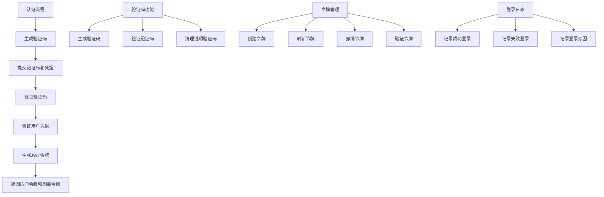

# 认证API模块

本目录包含用户认证和授权相关的API接口，实现了基于JWT的认证机制、验证码功能和登录日志记录功能。

## 目录结构

```
backend/src/api/v1/auth/
├── __init__.py        # 模块初始化文件
├── router.py          # 路由定义
├── dependencies.py    # 依赖项定义
└── schemas.py         # 请求和响应模型定义
```

## 功能概述

认证模块提供以下核心功能：

1. **验证码生成与验证**：支持图形验证码生成和验证，提高登录安全性
2. **用户登录**：支持用户名/密码认证，并集成验证码校验
3. **令牌刷新**：支持使用刷新令牌获取新的访问令牌
4. **用户登出**：支持将令牌加入黑名单，实现安全登出
5. **获取当前用户信息**：提供获取认证用户信息的接口
6. **登录日志记录**：记录用户登录行为，包括成功和失败的登录尝试

## API接口说明

### 1. 生成验证码

```
POST /api/v1/auth/captcha
```

生成图形验证码，返回验证码ID和图像的Base64编码。

**响应示例**：
```json
{
  "captcha_id": "uuid-string",
  "captcha_image": "data:image/png;base64,...",
  "expire_in": 300
}
```

### 2. 用户登录

```
POST /api/v1/auth/login
```

用户登录接口，接收用户名、密码和验证码信息，验证通过后返回访问令牌和刷新令牌。

**请求参数**：
```json
{
  "username": "用户名",
  "password": "密码",
  "captcha_id": "验证码ID",
  "captcha_text": "验证码文本"
}
```

**响应示例**：
```json
{
  "access_token": "eyJhbGciOiJIUzI1...",
  "refresh_token": "eyJhbGciOiJIUzI1...",
  "token_type": "bearer",
  "expires_in": 1800
}
```

### 3. 刷新令牌

```
POST /api/v1/auth/refresh
```

使用刷新令牌获取新的访问令牌。

**请求参数**：
```json
{
  "refresh_token": "eyJhbGciOiJIUzI1..."
}
```

**响应示例**：
```json
{
  "access_token": "eyJhbGciOiJIUzI1...",
  "refresh_token": "eyJhbGciOiJIUzI1...",
  "token_type": "bearer",
  "expires_in": 1800
}
```

### 4. 用户登出

```
POST /api/v1/auth/logout
```

用户登出接口，将访问令牌和刷新令牌加入黑名单。

**请求参数**：
```json
{
  "token": "eyJhbGciOiJIUzI1...",
  "refresh_token": "eyJhbGciOiJIUzI1..."
}
```

**响应**：
- 204 No Content：登出成功
- 400 Bad Request：登出失败

### 5. 获取当前用户信息

```
GET /api/v1/auth/me
```

获取当前认证用户的信息。

**请求头**：
```
Authorization: Bearer eyJhbGciOiJIUzI1...
```

**响应示例**：
```json
{
  "id": 1,
  "username": "用户名",
  "email": "用户邮箱",
  "phone": "用户电话",
  "is_active": true,
  "is_superuser": false,
  "created_at": "2023-01-01T00:00:00",
  "updated_at": "2023-01-01T00:00:00",
  "last_login": "2023-01-01T00:00:00"
}
```

## 核心依赖项

认证模块依赖于以下核心组件：

1. **AuthService**：认证服务，处理用户认证和令牌管理
2. **CaptchaManager**：验证码管理器，处理验证码的生成和验证
3. **TokenBlacklist**：令牌黑名单，管理已登出的令牌
4. **LoginLogService**：登录日志服务，记录用户登录行为

## 测试方法

### 测试文件结构

认证API的测试分为多个层次：
   - 验证码独立测试：`backend/src/tests/core/auth/standalone_test.py`
   - 登录日志独立测试：`backend/src/tests/core/auth/standalone_login_log_test.py`
   - 综合独立测试：`backend/src/tests/core/auth/complete_standalone_test.py`
   - API测试： `backend/src/tests/api/v1/auth/standalone_auth_api_test.py`

### 运行测试

#### 运行API独立测试
##### 独立的认证API测试脚本,测试认证API的各个接口，包括:
- 生成验证码
- 用户登录
- 令牌刷新
- 用户登出
- 获取当前用户信息

```bash
cd /data/projects/autotest/backend/src
python tests/api/v1/auth/standalone_auth_api_test.py -v
```

#### 运行核心功能测试
1. **standalone_test.py**: 验证码管理器独立测试
2. **standalone_login_log_test.py**: 登录日志服务独立测试
3. **complete_standalone_test.py**: 综合独立测试，包含验证码、登录日志和API集成测试

```bash
cd /data/projects/autotest/backend/src
python tests/core/auth/standalone_test.py
python tests/core/auth/standalone_login_log_test.py
python tests/core/auth/complete_standalone_test.py
```

### 测试覆盖范围

测试覆盖以下功能点：

1. **验证码功能**：
   - 生成验证码
   - 成功/失败验证验证码
   - 验证码不区分大小写
   - 处理无效/过期验证码

2. **用户登录**：
   - 成功登录
   - 无效凭据登录
   - 验证码错误登录
   - 多次失败锁定功能

3. **令牌操作**：
   - 刷新令牌
   - 无效令牌处理
   - 令牌黑名单

4. **用户信息**：
   - 获取当前用户信息
   - 无效令牌处理

5. **登录日志**：
   - 记录成功/失败登录
   - 记录登录失败原因

## 测试流程图

