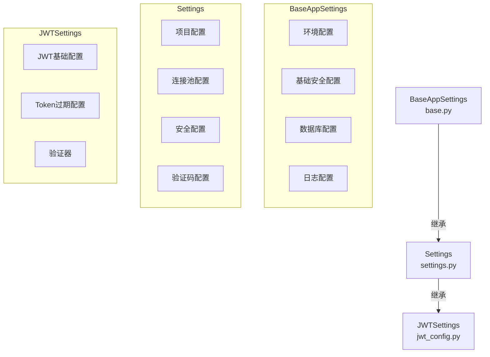

# 配置管理模块

本模块负责管理整个应用的配置，采用分层设计以实现配置的复用和解耦。

## 配置层次结构



## 配置文件说明

### 1. base.py
基础配置类，包含所有通用配置项：
- 环境配置（ENV, DEBUG）
- 基础安全配置（SECRET_KEY, ALLOWED_HOSTS）
- 数据库配置（MySQL, Redis, MongoDB）
- 日志配置（LOG_LEVEL, LOG_FORMAT, LOG_DIR）

### 2. settings.py
系统配置类，继承自BaseAppSettings，包含：
- 项目基本配置（PROJECT_NAME, VERSION, API_V1_STR）
- 数据库连接池配置
- 安全配置（密码策略、登录尝试限制等）
- 验证码配置

### 3. jwt_config.py
JWT配置类，继承自Settings，包含：
- JWT基础配置（密钥、算法、类型等）
- Token过期时间配置
- Token黑名单配置

## 使用方法

### 1. 基本用法
```python
from core.config.settings import settings

# 使用系统配置
db_host = settings.MYSQL_HOST
redis_port = settings.REDIS_PORT
```

### 2. JWT配置使用
```python
from core.config.jwt_config import jwt_settings

# 使用JWT配置
secret_key = jwt_settings.JWT_SECRET_KEY
token_expires = jwt_settings.get_access_token_expires()
```

### 3. 环境变量配置

配置优先级：
1. 环境变量
2. .env文件
3. 默认值

支持的环境变量文件：
- `.env`：主环境配置
- `.env.test`：测试环境配置

### 4. 配置验证
所有配置项都经过Pydantic验证，包括：
- 类型检查
- 值范围验证
- 自定义验证规则

## 开发指南

### 1. 添加新配置项
```python
from pydantic import Field

class Settings(BaseAppSettings):
    NEW_CONFIG: str = Field(
        default="default_value",
        description="配置项说明"
    )
```

### 2. 添加配置验证
```python
from pydantic import field_validator

@field_validator("CONFIG_NAME")
def validate_config(cls, v: str) -> str:
    # 验证逻辑
    return v
```

### 3. 环境特定配置
```python
def configure_for_environment(self) -> None:
    if self.ENV == "test":
        # 测试环境配置
        pass
    elif self.ENV == "production":
        # 生产环境配置
        pass
```

## 注意事项

1. 敏感信息处理：
   - 密码等敏感信息应通过环境变量配置
   - 使用`dict()`方法时会自动隐藏敏感信息

2. 配置继承：
   - 遵循配置层次结构
   - 避免重复定义配置项
   - 合理使用配置继承关系

3. 环境区分：
   - 开发环境：`ENV=development`
   - 测试环境：`ENV=test`
   - 生产环境：`ENV=production`

4. 配置更新：
   - 修改配置后需要重启服务
   - 使用`@lru_cache`确保配置单例

## 最佳实践

1. 使用环境变量管理敏感配置
2. 遵循配置层次结构
3. 为所有配置项添加描述
4. 使用类型注解和验证器
5. 合理组织配置分类
6. 定期检查和更新配置项

## 常见问题

1. 配置不生效
   - 检查环境变量是否正确设置
   - 确认配置文件位置正确
   - 重启服务使配置生效

2. 配置继承问题
   - 检查类继承关系
   - 确保没有循环继承
   - 避免重复定义配置项 