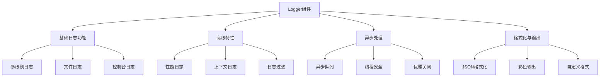

# 日志记录组件

## 简介
日志记录组件是一个功能完整、性能优化的日志系统，支持异步处理、多级别日志、文件轮转等特性，适用于生产环境的各种复杂场景。

## 核心功能架构



## 组件结构

### 1. logger.py - 核心日志实现
- 提供基础日志功能
- 支持异步处理
- 文件管理和轮转
- 格式化输出

### 2. decorators.py - 日志装饰器
- 函数调用日志
- 性能监控装饰器
- 异常捕获处理

### 3. middleware.py - HTTP中间件
- 请求日志记录
- 响应日志记录
- 性能监控
- 统一错误处理

## 功能特性

### 1. 基础日志功能

#### 1.1 多级别日志支持
- DEBUG：调试信息
- INFO：一般信息
- WARNING：警告信息
- ERROR：错误信息
- CRITICAL：严重错误

#### 1.2 日志输出配置
```python
logger = Logger(
    name="app",
    log_dir="logs",
    console_output=True,  # 控制台输出
    console_color=True    # 彩色显示
)
```

#### 1.3 文件管理
- 自动创建日志目录
- 日志文件轮转（默认10MB）
- 备份文件管理（默认保留5个）
- 权限检查和管理

### 2. 高级特性

#### 2.1 异步日志处理
```python
logger = Logger(
    async_mode=True,  # 启用异步处理
    name="async_logger"
)
```

#### 2.2 上下文日志
```python
logger.info_with_context("用户操作", {
    "user_id": 123,
    "action": "login",
    "ip": "127.0.0.1"
})
```

#### 2.3 性能日志
```python
with logger.log_performance("操作名称"):
    # 执行需要监控的操作
    pass
```

### 3. 格式化与输出

#### 3.1 JSON格式化
```json
{
  "timestamp": "2024-04-02T10:00:00",
  "level": "INFO",
  "message": "日志消息",
  "user_id": 123,
  "additional_data": "其他信息"
}
```

#### 3.2 彩色输出
- 不同级别使用不同颜色
- 支持控制台高亮显示
- 可配置开启/关闭

### 4. 安全特性

#### 4.1 错误处理
- 目录权限检查
- 文件访问异常处理
- 日志写入失败保护

#### 4.2 资源管理
- 自动关闭处理器
- 内存泄漏防护
- 线程安全保证

### 5. 扩展功能

#### 5.1 过滤器支持
```python
class CustomFilter(logging.Filter):
    def filter(self, record):
        return True  # 自定义过滤规则

logger.add_filter(CustomFilter())
```

#### 5.2 并发支持
- 线程安全设计
- 并发日志写入
- 队列缓冲机制

## 使用示例

### 1. 基础用法
```python
# 基础日志记录
logger.info("普通信息")
logger.error("错误信息")

# 带上下文的日志
logger.info_with_context("操作日志", {
    "user_id": 123,
    "action": "login"
})

# 性能监控
with logger.log_performance("数据库查询"):
    # 执行查询操作
    pass

# 优雅关闭
logger.flush()  # 刷新缓存
logger.close()  # 关闭日志器
```

### 2. 装饰器用法
```python
from core.logging import log_function_call, log_performance, log_exception

@log_function_call
async def some_function(arg1, arg2):
    pass

@log_performance
async def performance_critical_function():
    pass

@log_exception
async def function_with_error_handling():
    pass
```

### 3. 中间件用法
```python
from fastapi import FastAPI
from core.logging import logging_middleware

app = FastAPI()
app.add_middleware(logging_middleware)
```

## 最佳实践

1. **日志级别使用建议**
   - DEBUG：开发环境使用
   - INFO：常规操作信息
   - WARNING：潜在问题警告
   - ERROR：错误但不影响系统运行
   - CRITICAL：严重错误需立即处理

2. **性能优化建议**
   - 生产环境建议使用异步模式
   - 合理配置文件轮转大小
   - 适当设置日志级别过滤

3. **安全建议**
   - 敏感信息脱敏处理
   - 定期清理日志文件
   - 配置适当的文件权限

## 特点总结

1. **完整性**：覆盖所有常见日志需求
2. **灵活性**：提供多种配置选项
3. **可靠性**：完善的错误处理
4. **性能优化**：支持异步和并发
5. **易用性**：直观的API设计
6. **安全性**：完善的安全机制 