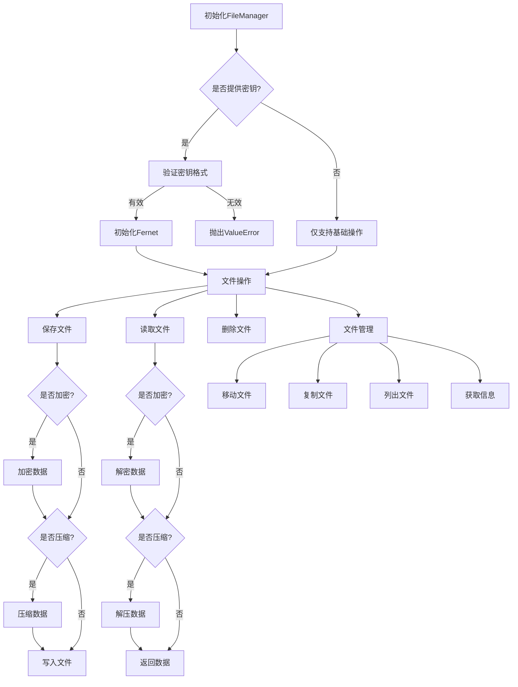

# 文件处理工具

## 功能概述

文件处理工具提供了一个统一的异步文件操作接口，支持以下核心功能：

- 文件的基本操作（保存、读取、删除、移动、复制）
- 文件压缩与解压
- 文件加密与解密
- 文件信息获取
- 文件哈希计算
- 目录文件列表

## 特性

- 异步操作：基于`aiofiles`实现异步文件操作
- 类型安全：完整的类型注解支持
- 错误处理：完善的异常处理机制
- 安全性：支持文件加密存储
- 通用性：支持多种文件输入类型

## 安装依赖

```bash
pip install aiofiles python-magic cryptography
```

## 基本配置

在项目的`.env`文件中配置文件存储相关信息：

```env
FILE_STORAGE_PATH=/path/to/storage
FILE_ENCRYPTION_KEY=your_encryption_key  # 可选，用于文件加密
```

## 使用示例

### 1. 初始化文件管理器

```python
from core.utils.file_manager import FileManager

# 初始化文件管理器
file_manager = FileManager(
    base_path="/path/to/storage",
    secret_key="your_encryption_key"  # 可选
)
```

### 2. 文件保存

```python
# 保存上传文件
from fastapi import UploadFile
upload_file = UploadFile(...)
path = await file_manager.save_file(
    file=upload_file,
    filename="uploads/example.txt",
    encrypt=True,  # 可选，是否加密
    compress=True  # 可选，是否压缩
)

# 保存字节数据
content = b"Hello World"
path = await file_manager.save_file(
    file=content,
    filename="data/example.bin"
)
```

### 3. 文件读取

```python
# 读取文件内容
content = await file_manager.read_file(
    filename="uploads/example.txt",
    decrypt=True,    # 如果文件已加密
    decompress=True  # 如果文件已压缩
)
```

### 4. 文件删除

```python
# 删除文件
success = await file_manager.delete_file("uploads/example.txt")
```

### 5. 文件列表

```python
# 列出目录下的所有文件
files = await file_manager.list_files(
    directory="uploads",
    pattern="*.txt"  # 可选，文件匹配模式
)
```

### 6. 获取文件信息

```python
# 获取文件详细信息
info = await file_manager.get_file_info("uploads/example.txt")
print(info)
# {
#     "name": "example.txt",
#     "size": 1024,
#     "created_time": "2024-03-20 10:00:00",
#     "modified_time": "2024-03-20 10:00:00",
#     "mime_type": "text/plain"
# }
```

### 7. 计算文件哈希

```python
# 计算文件哈希值
hash_value = await file_manager.calculate_hash(
    filename="uploads/example.txt",
    algorithm="sha256"  # 支持 md5/sha1/sha256
)
```

### 8. 文件移动和复制

```python
# 移动文件
new_path = await file_manager.move_file(
    source="uploads/old.txt",
    destination="archive/new.txt"
)

# 复制文件
new_path = await file_manager.copy_file(
    source="uploads/original.txt",
    destination="backup/copy.txt"
)
```

## 错误处理

文件管理器会抛出以下异常：

- `FileNotFoundError`: 文件不存在
- `ValueError`: 参数错误（如未配置加密密钥）
- `PermissionError`: 文件权限错误
- `OSError`: 文件系统操作错误

建议使用 try-except 进行异常捕获：

```python
try:
    content = await file_manager.read_file("example.txt")
except FileNotFoundError:
    print("文件不存在")
except ValueError as e:
    print(f"参数错误: {e}")
except Exception as e:
    print(f"操作失败: {e}")
```

## 性能优化建议

1. 对于大文件操作，建议启用压缩
2. 只在必要时使用文件加密
3. 合理设置基础存储路径，避免过深的目录结构
4. 使用批量操作代替多次单个操作
5. 及时清理临时文件

## 安全建议

1. 在生产环境中必须配置加密密钥
2. 验证文件类型，防止恶意文件上传
3. 限制上传文件大小
4. 使用安全的文件命名策略
5. 定期备份重要文件

## 注意事项

1. 所有文件路径都是相对于基础路径的
2. 文件名要使用正斜杠(/)作为路径分隔符
3. 加密文件必须使用相同的密钥才能解密
4. 压缩文件必须指定解压标志才能正确读取
5. 文件操作可能耗时，注意设置合适的超时时间

## 测试方法

### 1. 单元测试

使用pytest运行测试：

```bash
# 运行所有测试
PYTHONPATH=/path/to/backend/src pytest backend/tests/core/utils/test_file_manager.py -v

# 运行特定测试
pytest backend/tests/core/utils/test_file_manager.py::test_save_file_upload -v
```

### 2. 测试用例说明

1. 基础功能测试
   - `test_save_file_upload`: 测试上传文件保存
   - `test_save_file_bytes`: 测试字节数据保存
   - `test_read_file`: 测试文件读取
   - `test_delete_file`: 测试文件删除
   - `test_list_files`: 测试文件列表获取
   - `test_get_file_info`: 测试文件信息获取
   - `test_calculate_hash`: 测试文件哈希计算

2. 加密功能测试
   - `test_save_file_with_encryption`: 测试加密保存
   - `test_read_encrypted_file`: 测试加密文件读取
   - `test_invalid_encryption`: 测试无效加密操作

3. 压缩功能测试
   - `test_save_file_with_compression`: 测试压缩保存
   - `test_read_compressed_file`: 测试压缩文件读取

4. 文件操作测试
   - `test_move_file`: 测试文件移动
   - `test_copy_file`: 测试文件复制
   - `test_file_not_found`: 测试文件不存在情况

### 3. 测试数据

- 小文件测试：使用"Hello, World!"作为基础测试数据
- 大文件测试：使用重复1000次的"Hello, World!"测试压缩功能
- 临时目录：使用`tempfile.TemporaryDirectory`创建测试目录

## 密钥格式说明

### 1. 加密密钥要求

- 长度：必须是32字节
- 编码：必须是URL安全的base64编码字符串
- 格式：符合Fernet密钥规范

### 2. 密钥生成方法

```python
import base64
import secrets

# 方法1：使用secrets生成随机密钥
key = base64.urlsafe_b64encode(secrets.token_bytes(32)).decode()

# 方法2：从字符串生成密钥
raw_key = "your-secret-key".encode()[:32].ljust(32, b'\0')
key = base64.urlsafe_b64encode(raw_key).decode()
```

### 3. 密钥验证

密钥验证过程：
1. 检查是否是base64编码
2. 解码后验证长度是否为32字节
3. 尝试创建Fernet实例验证密钥有效性

## 工作流程图



## 性能指标

### 1. 文件操作性能

- 小文件(<1MB)：
  - 读写速度：<100ms
  - 加密开销：<50ms
  - 压缩开销：<30ms

- 大文件(>100MB)：
  - 建议分块处理
  - 启用压缩可节省存储空间
  - 加密会显著增加处理时间

### 2. 内存使用

- 默认读取块大小：8KB
- 最大文件大小限制：建议设置为系统内存的1/4
- 并发连接数：根据系统资源调整

### 3. 优化建议

1. 批量操作
   - 使用异步任务队列
   - 实现批量上传/下载
   - 合并小文件操作

2. 缓存策略
   - 缓存频繁访问的文件
   - 使用LRU缓存算法
   - 定期清理过期缓存

## 监控指标

### 1. 关键指标

- 文件操作成功率
- 平均响应时间
- 存储空间使用率
- 并发处理能力
- 错误发生频率

### 2. 日志记录

```python
import logging

logging.info("文件操作开始: %s", filename)
logging.error("操作失败: %s", error_message)
logging.debug("性能数据: 耗时 %dms", elapsed_time)
```

### 3. 告警设置

- 存储空间不足告警
- 操作错误率超限告警
- 响应时间过长告警
- 并发超限告警

## 最佳实践

### 1. 文件命名

- 使用UUID作为文件名前缀
- 保留原始文件扩展名
- 避免特殊字符
- 使用时间戳做版本管理

### 2. 目录结构

```
storage/
├── uploads/           # 上传文件
│   ├── images/       # 图片文件
│   ├── documents/    # 文档文件
│   └── temp/         # 临时文件
├── encrypted/         # 加密文件
├── compressed/        # 压缩文件
└── backup/           # 备份文件
```

### 3. 错误恢复

- 实现文件操作回滚机制
- 保留操作日志
- 定期备份重要数据
- 实现断点续传功能

### 4. 安全加固

- 实现文件访问权限控制
- 定期轮换加密密钥
- 实现文件完整性校验
- 防止路径穿越攻击

## 常见问题

### 1. 密钥相关

Q: 为什么会出现"Fernet key must be 32 url-safe base64-encoded bytes"错误？
A: 密钥必须是32字节的URL安全base64编码字符串，检查密钥格式是否正确。

Q: 如何安全存储加密密钥？
A: 使用环境变量或密钥管理系统，避免硬编码在代码中。

### 2. 性能相关

Q: 大文件上传很慢怎么办？
A: 考虑使用分片上传，并启用压缩功能。

Q: 如何处理并发访问？
A: 使用异步操作，并实现适当的锁机制。

### 3. 存储相关

Q: 如何管理存储空间？
A: 实现定期清理机制，设置存储配额。

Q: 如何确保文件安全？
A: 使用加密存储，实现访问控制，定期备份。 